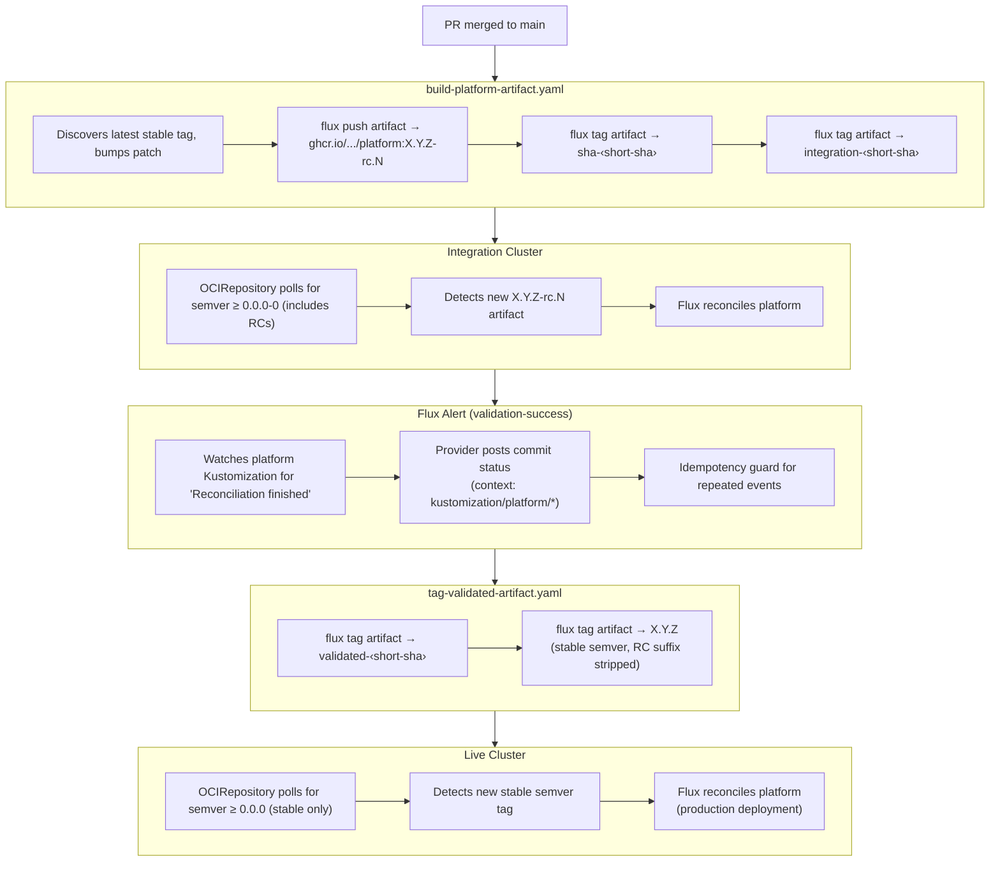
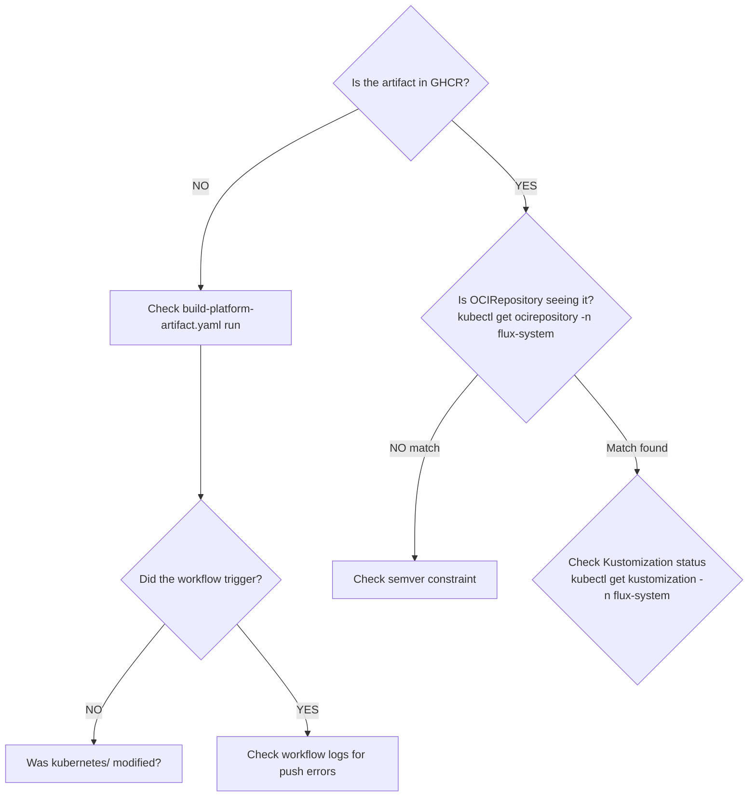

# GitHub Workflows - Claude Reference

GitHub Actions workflows that implement CI/CD for the homelab infrastructure, including the OCI artifact promotion pipeline.

For core principles and deployment philosophy, see [CLAUDE.md](../CLAUDE.md).

---

## Workflow Inventory

| Workflow | Trigger | Purpose |
|----------|---------|---------|
| `kubernetes-validate.yaml` | PR (kubernetes/ changes) | Validate K8s manifests, schemas, deprecations |
| `infrastructure-validate.yaml` | PR (infrastructure/ changes) | Format checks, module tests |
| `renovate-validate.yaml` | PR (renovate config) | Validate Renovate configuration |
| `build-platform-artifact.yaml` | Push to main (kubernetes/) | Build OCI artifact for promotion |
| `tag-validated-artifact.yaml` | status event (commit status) | Promote validated artifact to live |
| `renovate.yaml` | Scheduled (hourly) | Dependency update automation |
| `label-sync.yaml` | Scheduled/manual | Sync GitHub labels |

---

## OCI Artifact Promotion Pipeline

The promotion pipeline uses OCI artifacts for immutable, auditable deployments.

### Pipeline Flow



### Artifact Tagging Strategy

| Tag | Created By | Purpose |
|-----|------------|---------|
| `X.Y.Z-rc.N` | build workflow | Pre-release semver for integration OCIRepository polling |
| `sha-<short>` | build workflow | Immutable reference to commit |
| `integration-<short>` | build workflow | Marks artifact for integration |
| `validated-<short>` | tag workflow | Traceability reference for validated artifacts |
| `X.Y.Z` | tag workflow | Stable semver for live OCIRepository polling |

**Version numbering**: The build workflow discovers the latest stable tag (`X.Y.Z`) from GHCR,
bumps the patch version, and creates RC tags like `X.Y.(Z+1)-rc.N`. When validated, the RC
suffix is stripped to produce the stable tag `X.Y.(Z+1)`. This ensures RC tags always sort
higher than the previous stable release in semver ordering.

---

## Source Types by Cluster

| Cluster | Source Type | Semver/Pattern | Rationale |
|---------|-------------|----------------|-----------|
| `dev` | GitRepository | N/A | Fast iteration, no build step |
| `integration` | OCIRepository | `>= 0.0.0-0` | Accepts RC versions |
| `live` | OCIRepository | `>= 0.0.0` | Stable semver (validated artifacts) |

### Why Different Sources?

**Dev cluster** uses GitRepository because:
- Faster feedback loop (no build wait)
- Easy to test WIP changes
- Acceptable risk for dev environment

**Integration/Live clusters** use OCIRepository because:
- **Immutable artifacts**: Same bits deployed everywhere
- **Auditability**: Exact artifact version in GHCR
- **Promotion gates**: Validation must pass before live

---

## Debugging Guide

### Artifact Stuck in Integration?



### Validation Not Triggering Promotion?

```bash
# Check canary-checker status
kubectl get canaries -n canary-checker

# Check Alert configuration
kubectl get alerts -n flux-system

# Check Provider (GitHub) configuration
kubectl get providers -n flux-system

# Check if Alert fired
kubectl describe alert validation-success -n flux-system
```

### Tracing an Artifact

```bash
# 1. Find artifact in GHCR
flux list artifact oci://ghcr.io/<repo>/platform

# 2. Check tags
flux list artifact oci://ghcr.io/<repo>/platform | grep <sha>

# 3. Check which cluster has it
kubectl get ocirepository -n flux-system -o yaml | grep -A5 "artifact"

# 4. Check reconciliation status
flux get kustomizations -A
```

### Common Failure Modes

| Symptom | Cause | Fix |
|---------|-------|-----|
| Build succeeds but integration doesn't update | Semver not matching `>= 0.0.0-0` | Check OCIRepository spec |
| Validation passes but live doesn't update | `validated-*` tag not applied | Check tag-validated workflow |
| Commit status not posted | `flux-system` secret token lacks `statuses:write` permission | Check notification-controller logs for explicit API errors, update token in SSM |
| Commit status posted but workflow doesn't trigger | Job-level `if` filter not matching context prefix | Check `github.event.context` format: should start with `kustomization/platform/` |
| Artifact push fails | GHCR auth issue | Check `GITHUB_TOKEN` permissions |
| Workflow triggers every ~10min | Alert fires on every reconciliation | Idempotency guard skips already-validated artifacts |

### Manual Promotion (Emergency)

If automatic promotion fails, manually tag:

```bash
# Authenticate
echo $GITHUB_TOKEN | docker login ghcr.io -u $GITHUB_USER --password-stdin

# Tag manually
flux tag artifact \
  oci://ghcr.io/<repo>/platform:integration-<sha> \
  --tag validated-<sha>
```

### Rollback Procedure

```bash
# Find previous validated artifact
flux list artifact oci://ghcr.io/<repo>/platform | grep validated

# Re-tag previous artifact as latest validated
flux tag artifact \
  oci://ghcr.io/<repo>/platform:validated-<old-sha> \
  --tag validated-<old-sha>-rollback

# Or: Patch OCIRepository to pin specific version
kubectl patch ocirepository platform -n flux-system \
  --type=merge \
  -p '{"spec":{"ref":{"tag":"validated-<old-sha>"}}}'
```

---

## Workflow Details

### kubernetes-validate.yaml

Runs on PRs touching `kubernetes/`:

1. **Lint**: yamllint on all YAML
2. **Expand**: flux-operator expands ResourceSets
3. **Build**: kustomize build with variable substitution
4. **Template**: Helm template all charts
5. **Validate**: kubeconform schema validation
6. **Deprecations**: pluto checks for removed APIs

### infrastructure-validate.yaml

Runs on PRs touching `infrastructure/`:

1. **Format**: terragrunt hclfmt + tofu fmt
2. **Test**: tofu test for modified modules

### build-platform-artifact.yaml

Triggers on push to main (kubernetes/ changes):

1. **Resolve version**: Queries GHCR for latest stable tag, bumps patch, increments RC number
2. **Push artifact**: `flux push artifact ... :X.Y.Z-rc.N`
3. **Tag**: Adds `sha-<short>` and `integration-<short>` tags

### tag-validated-artifact.yaml

Triggers on `status` event (GitHub commit status posted by Flux's `github` Provider):

1. **Filter**: Only runs on `state == 'success'` with context prefix `kustomization/platform/`
2. **Resolve**: Extracts short SHA from commit, finds `integration-<sha>` artifact, extracts RC tag
3. **Derive stable**: Strips `-rc.N` suffix (e.g., `0.1.146-rc.3` → `0.1.146`)
4. **Tag**: Adds `validated-<sha>` and stable semver tags

---

## Cross-References

| Document | Focus |
|----------|-------|
| [CLAUDE.md](../CLAUDE.md) | Promotion pipeline overview, principles |
| [kubernetes/clusters/CLAUDE.md](../kubernetes/clusters/CLAUDE.md) | Per-cluster OCIRepository configuration |
| [kubernetes/platform/CLAUDE.md](../kubernetes/platform/CLAUDE.md) | Flux patterns, ResourceSets |
