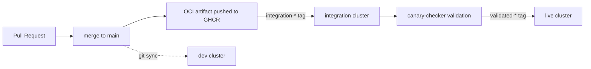

# 🏠 ionfury-homelab

Enterprise-grade bare-metal Kubernetes platform, managed declaratively from PXE boot to production workloads. Three physical clusters, a promotion pipeline with automated validation, and zero manual operations — if it's not in git, it doesn't exist.

---

<div align="center">

&nbsp;&nbsp;
[](https://github.com/kashalls/kromgo/)&nbsp;&nbsp;
[](https://github.com/kashalls/kromgo/)&nbsp;&nbsp;
[](https://github.com/kashalls/kromgo/)&nbsp;&nbsp;
[](https://github.com/kashalls/kromgo/)&nbsp;&nbsp;
[](https://github.com/kashalls/kromgo/)&nbsp;&nbsp;
[](https://github.com/kashalls/kromgo/)&nbsp;&nbsp;
[](https://github.com/kashalls/kromgo/)&nbsp;&nbsp;
[](https://github.com/kashalls/kromgo/)&nbsp;&nbsp;

[](https://github.com/kashalls/kromgo/)&nbsp;&nbsp;
[](https://github.com/kashalls/kromgo/)&nbsp;&nbsp;
[](https://github.com/kashalls/kromgo/)&nbsp;&nbsp;

*Live from the production cluster via [kromgo](https://github.com/kashalls/kromgo) — versions shown are observed state, not declared. Declared versions live in [`versions.env`](kubernetes/platform/versions.env).*

</div>

---

## Overview

This repository contains the complete infrastructure and GitOps configuration for my homelab: bare-metal Supermicro nodes PXE-booting into [Talos Linux](https://www.talos.dev/), provisioned by [Terragrunt](https://terragrunt.gruntwork.io/)/[OpenTofu](https://opentofu.org/), and reconciled by [Flux](https://fluxcd.io/) from this repo. Everything is declarative, reproducible, and self-healing — the goal is to push "infrastructure as code" from the BIOS all the way to an SLO dashboard.

The design principle throughout: **changes flow through a promotion pipeline, never directly to production.** A merge to `main` is packaged as an OCI artifact, deployed to an integration cluster, validated by automated canary checks, and only then promoted to the live cluster. Drift is a bug, not an acceptable state.

## Table of Contents

- [Overview](#overview)
- [Repository Structure](#repository-structure)
- [Clusters & Promotion Pipeline](#clusters--promotion-pipeline)
- [Architecture](#architecture)
  - [Hardware](#hardware)
  - [Networking](#networking)
  - [Cloud Dependencies](#cloud-dependencies)
- [Provisioning](#provisioning)
- [Platform](#platform)
  - [GitOps Model](#gitops-model)
  - [Version Management & Upgrades](#version-management--upgrades)
  - [Storage & Backup](#storage--backup)
  - [Security](#security)
- [Workloads](#workloads)
- [Tooling](#tooling)
- [Acknowledgements](#acknowledgements)
- [License](#license)

## Repository Structure

```
📁
├─ .github/          # CI workflows: validation, artifact builds, Renovate
├─ .taskfiles/       # Task runner definitions (terragrunt, talos, k8s, dr, ...)
├─ docs/             # Architecture notes, runbooks, investigations
├─ infrastructure/   # Terragrunt/OpenTofu: PXE, Talos, cluster provisioning
│  ├─ stacks/        # Stack deployments (dev, integration, live, storage, global)
│  ├─ units/         # Reusable Terragrunt units (thin wiring layers)
│  ├─ modules/       # OpenTofu modules (provisioning logic)
│  └─ inventory.hcl  # Hardware inventory: hosts, MACs, IPs, disks
└─ kubernetes/
   ├─ platform/      # Centralized platform: one definition, deployed everywhere
   └─ clusters/      # Per-cluster bootstrap + cluster-specific workloads
```

## Clusters & Promotion Pipeline

Three physical clusters with distinct roles form a promotion pipeline:

| Cluster | Hardware | Source | Purpose |
|---------|----------|--------|---------|
| `dev` | 1 node | Git (`main`) | Manual experimentation, direct mutation allowed |
| `integration` | 3-node HA | OCI `integration-*` tags | Automated deployment + validation |
| `live` | 3-node HA + workers | OCI `validated-*` tags | Production — strict GitOps only |



A merge to `main` triggers a GitHub Actions workflow that packages the platform as an OCI artifact. The integration cluster auto-deploys it, [canary-checker](https://canarychecker.io/) runs synthetic health checks against the result, and only a passing validation re-tags the artifact for the live cluster to consume. Production never sees a change that hasn't already converged successfully on identical hardware.

## Architecture

The network is segmented with VLANs; one segment (`citadel`) is dedicated to Kubernetes infrastructure, where PXE, DNS, and bootstrapping happen.

<details>
  <summary>Click to see VLAN diagram</summary>
  
</details>

### Hardware

| Device | CPU | RAM | Disks | Purpose |
|--------|-----|-----|-------|---------|
| Supermicro nodes | Xeon E5 / D | 32–128GB | SSDs + HDDs | Talos cluster nodes (+ NVIDIA GPU for ML workloads) |
| Raspberry Pi 4 | ARM | 2–8GB | microSD | PXE boot services |
| Unifi Aggregation | — | — | — | 10G switching |
| CyberPower UPS | — | — | — | Battery backup + power monitoring |

<details>
  <summary>Front of rack</summary>
  
</details>

<details>
  <summary>Back of rack</summary>
  
</details>

### Networking

Networking is handled via Unifi. Cluster nodes live in a dedicated subnet with static MAC-based assignments; each cluster gets its own pod CIDR.

- **CNI**: [Cilium](https://cilium.io/) with kube-proxy replacement and enforced `CiliumNetworkPolicy` — application namespaces opt into network profiles via labels, and unlabeled pods get no connectivity
- **Service mesh**: [Istio ambient mesh](https://istio.io/latest/docs/ambient/) with mTLS; the mesh CA is shared across clusters via AWS SSM for cross-cluster trust, with [istio-csr](https://cert-manager.io/docs/usage/istio-csr/) bridging certificate issuance to cert-manager
- **Ingress**: Gateway API via Istio gateways, with dedicated internal and external entry points
- **DNS**: external-dns manages records; internal and external domains are split per cluster

### Cloud Dependencies

The lab is self-sufficient except for a minimal external footprint:

| Service | Purpose | Cost |
|---------|---------|------|
| GitHub | Source of truth, CI/CD, OCI artifact registry (GHCR) | Free |
| Cloudflare | DNS + public exposure | ~$10/year |
| AWS | S3 (Terraform state, backups), SSM Parameter Store (secrets), DynamoDB (state locking) | ~$10/year |
| Healthchecks.io | Dead-man's-switch heartbeat | Free |

Total: **~$20/year**

## Provisioning

Bare metal to running cluster, no hands:

1. **PXE boot** — nodes network-boot into Talos Linux from a declaratively managed PXE environment (MAC-to-IP mapping lives in [`inventory.hcl`](infrastructure/inventory.hcl))
2. **Terragrunt** — `infrastructure/stacks/<cluster>` provisions Talos machine configs, bootstraps the cluster, and installs Flux
3. **Flux** — reconciles the platform from `kubernetes/`, and the cluster converges to desired state

Infrastructure is split into stacks with different lifecycles: cluster stacks (`dev`, `integration`, `live`) are ephemeral and rebuildable at any time, while the `storage` stack (backup buckets, IAM, credentials) persists independently — so a cluster can be destroyed and restored from backup without ceremony.

Supermicro IPMI configuration (NTP, naming, credential rotation) is automated and documented in [`docs/runbooks`](docs/runbooks).

## Platform

### GitOps Model

The platform uses [Flux ResourceSets](https://fluxcd.control-plane.io/operator/resourcesets/introduction/) for centralized, DRY management: every Helm release across all clusters is defined once in [`kubernetes/platform/helm-charts.yaml`](kubernetes/platform/helm-charts.yaml), with per-cluster values substituted from ConfigMaps. Clusters reference the shared platform and layer cluster-specific workloads on top using the same pattern.

Core platform components:

| Concern | Components |
|---------|-----------|
| Networking | Cilium, Istio (ambient), Gateway API, external-dns |
| Storage | Longhorn (block), Garage (S3-compatible object) |
| Data | CloudNative-PG (Postgres), Dragonfly (Redis-compatible cache) |
| Observability | kube-prometheus-stack, Grafana, Loki, Alloy, canary-checker, kromgo, hardware exporters (IPMI, SNMP, SMART, DCGM) |
| Security | cert-manager, external-secrets (AWS SSM), Authelia + LLDAP (SSO), oauth2-proxy |
| Operations | Flux operator, Tuppr, Velero, Spegel, Reloader, descheduler, silence-operator |

### Version Management & Upgrades

Every version in the platform — Talos, Kubernetes, Helm charts, container images — lives in `versions.env` files annotated for [Renovate](https://docs.renovatebot.com/). Renovate opens PRs; merging one sends the bump through the same promotion pipeline as any other change.

Talos and Kubernetes upgrades are executed *from within the cluster* by [Tuppr](https://github.com/home-operations/tuppr): bump the version in git, and the controller rolls the nodes. No `talosctl upgrade` from a laptop.

### Storage & Backup

- **Longhorn** provides replicated block storage with scheduled snapshot/backup jobs to S3
- **Velero** backs up cluster state and volumes, with 90-day lifecycle expiration
- Backup buckets are provisioned by the persistent `storage` stack, decoupled from cluster lifecycle — full disaster recovery works even after complete cluster loss

### Security

- No secrets in git — external-secrets pulls from AWS SSM Parameter Store
- PodSecurity profiles (`restricted`/`baseline`/`privileged`) enforced per namespace
- Default-deny network posture: namespaces opt into connectivity via policy profiles
- SSO via Authelia backed by LLDAP, fronting internal services
- mTLS everywhere via Istio ambient mesh

## Workloads

The live cluster runs the usual suspects: Immich, Jellyfin + the *arr stack, Home Assistant, Paperless-ngx, Vaultwarden, Mealie, Homepage, Open WebUI + Ollama (GPU-backed), and game servers (Minecraft, Satisfactory). Cluster-specific workloads are defined in [`kubernetes/clusters/live`](kubernetes/clusters/live) using the same ResourceSet pattern as the platform.

## Tooling

Local tooling is pinned via [mise](https://mise.jdx.dev/) ([`.mise.toml`](.mise.toml)) and orchestrated with [Task](https://taskfile.dev/):

```sh
task                  # list all tasks
task k8s:validate     # full local validation: lint, ResourceSet expansion, helm template, kubeconform
task tg:validate-live # validate a Terragrunt stack
```

CI validates every PR: YAML lint, ResourceSet expansion, Helm templating, schema validation (kubeconform), API deprecation checks (pluto), and Terragrunt validation.

## Acknowledgements

Thanks to the [Home Operations](https://discord.gg/home-operations) Discord community for shared patterns and tools. If you're building something similar, start there — and browse [kubesearch.dev](https://kubesearch.dev/) for real-world chart configurations.

## License

See [LICENSE](./LICENSE)
