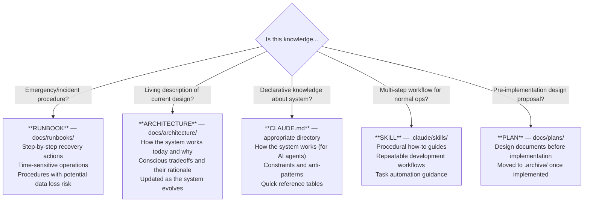

# Documentation - Claude Reference

The `docs/` directory contains operational runbooks, architecture documents, plans, and supporting assets.

---

## Directory Structure

```
docs/
├── architecture/       # Living descriptions of current system design
├── runbooks/           # Emergency and operational procedures
├── plans/              # Pre-implementation design proposals
│   └── .archive/       # Superseded plans
└── images/             # Supporting images and diagrams
```

---

## Architecture Documents

Architecture docs describe **how the system works today** — living documents updated as the system evolves. Unlike plans (point-in-time proposals) or runbooks (emergency procedures), these capture current design, rationale, and relationships.

| Document | Domain | Purpose |
|----------|--------|---------|
| `backup-strategy.md` | Storage | Storage class taxonomy, data protection matrix, backup data flows |
| `network-segmentation.md` | Network | Two-tier Cilium policy model, profiles, shared resource access |
| `promotion-pipeline.md` | CI/CD | OCI artifact promotion from PR merge to live deployment |
| `secret-management.md` | Security | Four-tier secret architecture (generator, ESO, app-secrets, replicator) |

---

## Runbook Inventory

| Runbook | Trigger Condition | Est. Time | Related Docs |
|---------|-------------------|-----------|--------------|
| `velero-disaster-recovery.md` | Complete cluster loss, need Velero restore | ~30 min | infrastructure/CLAUDE.md |
| `network-policy-escape-hatch.md` | Emergency - network policies blocking critical traffic | ~5 min | kubernetes/platform/CLAUDE.md |
| `network-policy-verification.md` | Verify network policy enforcement with Hubble | ~10 min | kubernetes/platform/CLAUDE.md |
| `resize-volume.md` | Longhorn auto-expansion fails, PVC at capacity | ~5 min | kubernetes/platform/CLAUDE.md |
| `supermicro-machine-setup.md` | New hardware - initial BIOS/IPMI config | ~20 min | infrastructure/CLAUDE.md |
| `terragrunt-validation-state-issues.md` | Terragrunt validate fails with partial state | ~10 min | infrastructure/CLAUDE.md |
| `version-holds.md` | Upstream regression in automerged dependency | ~5 min | `.github/renovate.json5` |

---

## Plan Documents

| Plan | Status | Purpose |
|------|--------|---------|
| `coraza-waf.md` | Implemented | Coraza WAF integration for ingress protection |
| `network-policy-architecture.md` | Implemented | Two-tier network policy model (namespace + workload) |
| `oci-artifact-promotion.md` | In Progress | OCI-based GitOps promotion pipeline |

---

## Documentation Decision Tree

Use this decision tree to determine where documentation belongs:



Templates and format guidelines: see `docs/templates/` for `architecture-template.md` and `runbook-template.md`.

---

## Cross-References

| Document | Focus |
|----------|-------|
| [Root CLAUDE.md](../CLAUDE.md) | Core principles, runbooks table |
| [infrastructure/CLAUDE.md](../infrastructure/CLAUDE.md) | Infrastructure patterns |
| [kubernetes/platform/CLAUDE.md](../kubernetes/platform/CLAUDE.md) | Platform configuration |
| [.claude/skills/CLAUDE.md](../.claude/skills/CLAUDE.md) | Skill architecture |

### Related Skills

| Skill | Use For |
|-------|---------|
| `k8s` | Cluster access, kubectl patterns, Flux status |
| `sre` | Kubernetes debugging (before escalating to runbook) |
| `terragrunt` | Infrastructure operations |
| `flux-gitops` | GitOps debugging |
