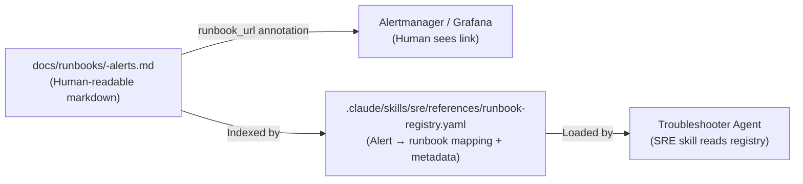
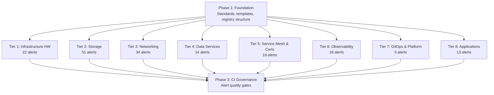

# Alert Audit & Runbook Architecture Plan

## Overview

Systematic audit of all 216 alerts across 24 PrometheusRule files, paired with the creation of domain runbooks and an agent-consumable runbook registry. The goal is twofold: eliminate alert noise (alerts that fire without actionable remediation) and establish governance so alert quality doesn't degrade over time.

### Goals

- **Zero noise baseline**: Every surviving alert must be actionable — if it fires, someone (or something) knows exactly what to do
- **Domain runbooks**: One runbook per subsystem covering all alerts in that domain, with branching sections per alert class
- **Agent-consumable registry**: Structured YAML index in the SRE skill so the troubleshooter agent can auto-load relevant procedures when investigating incidents
- **CI enforcement**: Validation gate preventing new alerts without runbooks

### Non-Goals

- Per-alert runbooks (too granular, creates duplication)
- Rewriting upstream kube-prometheus-stack alerts (those have their own runbook ecosystem)
- Real-time alert auto-remediation (runbooks guide investigation, not automation)

---

## Current State

| Metric | Value |
|--------|-------|
| Total custom alerts | 216 across 24 files |
| Alerts with `runbook_url` | 3 (1.4%) |
| Existing runbooks in `docs/runbooks/` | 9 (only 2 linked from alerts) |
| CI validation for alert quality | None |
| Agent runbook discovery | None |

### Alert Distribution by Domain

| Domain | Files | Alerts | Critical | Warning |
|--------|-------|--------|----------|---------|
| Infrastructure hardware (IPMI, SNMP, SMART, UPS, GPU) | 3 | 22 | 10 | 12 |
| Storage (Longhorn, Garage) | 2 | 51 | 14 | 37 |
| Networking (Cilium, network-policy) | 2 | 34 | 9 | 25 |
| Data services (CNPG, Dragonfly) | 2 | 14 | 8 | 6 |
| Service mesh & certificates (Istio, cert-manager) | 2 | 19 | 7 | 12 |
| Observability (Loki, Grafana, Alloy, canary-checker) | 4 | 18 | 6 | 12 |
| GitOps & platform (Flux, External Secrets) | 2 | 5 | 2 | 3 |
| Applications (Excalidraw, media, Authelia, AI) | 4 | 13 | 7 | 6 |
| **Total** | **24** | **216** | **73** | **141** |

---

## Architecture

### Dual-Audience Runbook Model

Runbooks serve two consumers through a single source of truth:



- **Humans** see the `runbook_url` annotation in Alertmanager/Grafana and click through to the markdown runbook
- **Agents** read the YAML registry to discover which runbook covers a given alert, along with structured metadata (quick triage commands, decision trees, severity context)

### Runbook Registry Format

The registry lives in `.claude/skills/sre/references/runbook-registry.yaml` and maps alert names to runbooks with structured metadata:

```yaml
# Example entry
longhorn:
  runbook: docs/runbooks/longhorn-alerts.md
  alerts:
    LonghornVolumeStatusCritical:
      section: "#volume-health"
      severity: critical
      triage:
        - "kubectl get volumes.longhorn.io -A -o wide"
        - "kubectl get nodes -l node.longhorn.io/create-default-disk=true"
      symptoms:
        - "Volume in Degraded or Faulted state"
        - "Replicas not scheduling"
    LonghornBackupStale:
      section: "#backup-health"
      severity: critical
      triage:
        - "kubectl get backups.longhorn.io -A --sort-by=.status.lastBackupAt"
        - "kubectl logs -n longhorn-system -l app=longhorn-manager --tail=50"
      symptoms:
        - "No successful backup in over 24 hours"
        - "Backup target unreachable"
```

### Domain Runbook Format

Domain runbooks extend the existing runbook template with alert-oriented sections:

```markdown
# Runbook: <Domain> Alerts

## Overview
What this subsystem does and why its alerts matter.

## Quick Reference
| Alert | Severity | Likely Cause | First Action |
|-------|----------|-------------|--------------|
| AlertName1 | critical | ... | ... |
| AlertName2 | warning | ... | ... |

## Triage Decision Tree

(Mermaid flowchart: symptom → investigation path → remediation)

## Alert Procedures

### Volume Health
Covers: LonghornVolumeStatusCritical, LonghornVolumeStatusDegraded

#### Symptoms
...

#### Investigation
...

#### Remediation
...

### Backup Health
Covers: LonghornBackupStale, LonghornBackupFailed, LonghornBackupNeverCompleted
...

## Verification
How to confirm all alerts in this domain are resolved.

## Related
Links to architecture docs, CLAUDE.md sections, other runbooks.
```

---

## Alert Quality Standards

Every non-meta alert must meet these criteria to survive the audit:

### Required Annotations

| Annotation | Purpose | Example |
|------------|---------|---------|
| `summary` | One-line description with template variables | `"Longhorn volume {{ $labels.volume }} is {{ $labels.state }}"` |
| `description` | Detailed context with impact and data | `"Volume has been degraded for >10m. Replicas: {{ $value }}..."` |
| `runbook_url` | GitHub link to domain runbook section | `"https://github.com/ionfury/homelab/blob/main/docs/runbooks/longhorn-alerts.md#volume-health"` |

### Severity Criteria

| Severity | Criteria | Expected Response |
|----------|----------|-------------------|
| `critical` | Service impact is occurring or imminent. Data loss risk. Requires immediate human attention. | Wake someone up at 3 AM. |
| `warning` | Degradation detected but service is functional. Will become critical if not addressed. | Investigate during business hours. |
| `info` | Informational — system operating normally but a condition is noteworthy. | Review in daily triage. |

### Audit Checklist (Per Alert)

1. **Is this alert actionable?** If it fires, does someone know what to do? If not → remove or redesign.
2. **Is the threshold right?** Does it fire on actual problems or normal behavior? (cf. LonghornSnapshotSpaceWarning)
3. **Is the severity correct?** Would you wake someone up for this? If not, it's not critical.
4. **Is it already covered?** Does another alert detect the same failure mode more accurately? If so → remove the redundant one.
5. **Does it have all required annotations?** Summary, description, runbook_url.
6. **Is the `for` duration appropriate?** Too short = flapping. Too long = delayed response.

### Meta Alerts (Exempt from Runbook Requirement)

These alerts validate the monitoring system itself and don't need operational runbooks:

- `Watchdog` — Alertmanager liveness (fires continuously when healthy)
- `InfoInhibitor` — Suppresses info alerts when warning/critical exist

---

## Implementation Sequence

### Phase 1: Foundation

Define the standards and structures that all subsequent work follows.

**Deliverables:**
- Alert quality standards (documented above, codified in this plan)
- Domain runbook markdown template
- SRE registry YAML format and initial file structure
- Update `docs/CLAUDE.md` with new runbook naming pattern (`<domain>-alerts.md`)
- Update `.claude/skills/sre/SKILL.md` to reference the registry

### Phase 2: Domain Audits

Each domain is independently auditable and mergeable. No ordering required between domains — work in whatever order makes sense.

#### Tier 1: Infrastructure Hardware

**Scope**: `monitoring/hardware-monitoring-alerts.yaml`, `monitoring/ups-monitoring-alerts.yaml`, `monitoring/gpu-monitoring-alerts.yaml`
**Alerts**: 22 (10 critical, 12 warning)
**Runbook**: `docs/runbooks/infrastructure-hardware-alerts.md`

Key audit questions:
- Are IPMI/SNMP target-down alerts useful when we already have node-level health checks?
- Are temperature thresholds calibrated to actual hardware specs?
- Do UPS alerts correctly distinguish "on battery (expected)" from "on battery (failure)"?

#### Tier 2: Storage

**Scope**: `longhorn/prometheus-rules.yaml`, `garage/prometheus-rules.yaml`
**Alerts**: 51 (14 critical, 37 warning)
**Runbooks**: `docs/runbooks/longhorn-alerts.md`, `docs/runbooks/garage-alerts.md`

Key audit questions:
- After removing LonghornSnapshotSpaceWarning, are remaining Longhorn alerts all actionable?
- Are Garage partition/quorum alerts calibrated to actual cluster topology?
- Do storage pool alerts overlap with node storage alerts?

#### Tier 3: Networking

**Scope**: `cilium-alerts.yaml`, `network-policy-alerts.yaml`
**Alerts**: 34 (9 critical, 25 warning)
**Runbook**: `docs/runbooks/cilium-alerts.md` (network-policy alerts already have `network-policy-escape-hatch.md`)

Key audit questions:
- Are BPF map pressure thresholds calibrated to actual map sizes?
- Is `CiliumPolicyDropsHigh` distinguishing policy enforcement (expected) from misconfig (unexpected)?
- Do we need both `CiliumAgentDown` and `CiliumUnreachableNodes`?

#### Tier 4: Data Services

**Scope**: `database/prometheus-rules.yaml`, `dragonfly/prometheus-rules.yaml`
**Alerts**: 14 (8 critical, 6 warning)
**Runbook**: `docs/runbooks/database-alerts.md`

Key audit questions:
- Are WAL archiving alerts calibrated to actual backup schedule?
- Is `CNPGClusterHighConnections` threshold based on actual pooler limits?
- Is Dragonfly replication monitoring useful in our single-instance topology?

#### Tier 5: Service Mesh & Certificates

**Scope**: `istio-alerts.yaml`, `cert-manager-alerts.yaml`
**Alerts**: 19 (7 critical, 12 warning)
**Runbook**: `docs/runbooks/service-mesh-alerts.md`

Key audit questions:
- Are Istio ambient mode alerts relevant? (Some may be for sidecar mode only)
- Do cert-manager expiry alerts (14d, 7d, 24h) add value when renewal is automated?
- Is `IstiodHighClientCount` calibrated to actual cluster size?

#### Tier 6: Observability

**Scope**: `loki-mixin-alerts.yaml`, `grafana-alerts.yaml`, `alloy-alerts.yaml`, `canary-checker/prometheus-rules.yaml`
**Alerts**: 18 (6 critical, 12 warning)
**Runbook**: `docs/runbooks/observability-alerts.md`

Key audit questions:
- Are Loki mixin alerts tuned for our scale, or are they upstream defaults?
- Is `GrafanaDatasourceUnhealthy` actionable or just noise during rollouts?
- Are Alloy drop/lag alerts calibrated to actual ingestion rates?

#### Tier 7: GitOps & Platform

**Scope**: `monitoring/flux-alerts.yaml`, `external-secrets-alerts.yaml`
**Alerts**: 5 (2 critical, 3 warning)
**Runbook**: `docs/runbooks/gitops-alerts.md`

Key audit questions:
- Do Flux alerts fire during normal reconciliation cycles?
- Is `ExternalSecretSyncFailure` distinguishing transient vs persistent failures?

#### Tier 8: Applications

**Scope**: `excalidraw/prometheus-rules.yaml`, `media/prometheus-rules.yaml`, `media/exportarr-alerts.yaml`, `authelia/prometheus-rules.yaml`, `ai/prometheus-rules.yaml`
**Alerts**: 13 (7 critical, 6 warning)
**Runbook**: `docs/runbooks/application-alerts.md`

Key audit questions:
- Should application-down alerts be critical? Most apps are non-essential.
- Are media volume alerts duplicating Longhorn volume alerts?
- Is `AutheliaHighAuthFailureRate` calibrated to actual traffic patterns?

### Phase 3: CI Governance

Add alert quality validation to `task k8s:validate` so regressions are impossible.

**Deliverables:**
- Validation script that checks all PrometheusRule resources for:
  - Required annotations (`summary`, `description`, `runbook_url`) on non-meta alerts
  - `runbook_url` points to a file that exists in the repo
  - PromQL expression syntax validity (using `promtool check rules` if available)
  - Consistent alert naming conventions
- Integration into `task k8s:validate` pipeline
- Documentation in `.taskfiles/CLAUDE.md`

---

## Dependency Graph



- **Phase 1** blocks all audit tiers (they need the standards and templates)
- **Audit tiers** are independent and can be done in any order or in parallel
- **Phase 3** requires at least one audit tier complete (needs real data to validate against)

---

## Success Criteria

- [ ] Every non-meta alert has `summary`, `description`, and `runbook_url` annotations
- [ ] Every `runbook_url` points to an existing domain runbook with a relevant section
- [ ] SRE skill registry covers all alerts with triage commands and symptom mappings
- [ ] `task k8s:validate` rejects PRs that add alerts without required annotations
- [ ] Troubleshooter agent can discover and load relevant runbook content when investigating any alert
- [ ] No alerts are firing that lack a clear remediation path
