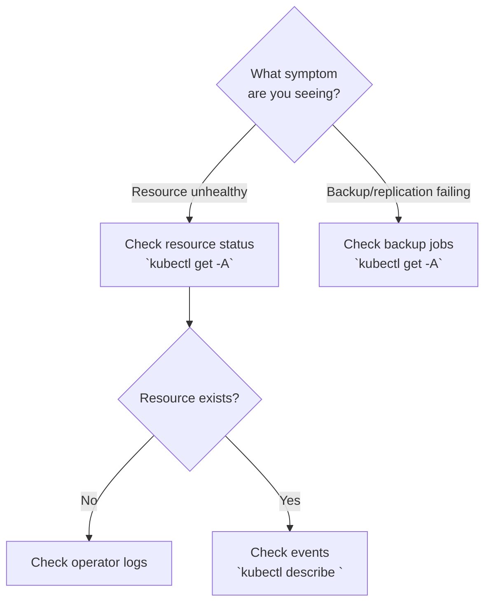

# Runbook: <Domain> Alerts

## Overview

<!-- What this subsystem does, why its alerts matter, and what failure looks like. -->

## Quick Reference

| Alert | Severity | Likely Cause | First Action |
|-------|----------|-------------|--------------|
| `AlertName1` | critical | Brief root cause | `kubectl get ...` |
| `AlertName2` | warning | Brief root cause | `kubectl describe ...` |

## Triage Decision Tree

<!-- Mermaid flowchart guiding the operator from symptom to investigation path.
     Use decision diamonds for branching, process nodes for actions. -->



## Alert Procedures

### Section Name

**Covers:** AlertName1, AlertName2

#### Symptoms

- What the operator sees in monitoring/alerts
- Observable effects on dependent services

#### Investigation

1. First diagnostic command with explanation
   ```bash
   kubectl get <resource> -n <namespace> -o wide
   ```
2. Second diagnostic step
3. What to look for in the output

#### Remediation

- **Immediate**: Quick mitigation to restore service
- **Permanent**: Root cause fix (link to relevant config files)
- **Prevention**: What would prevent recurrence

---

<!-- Repeat ### Section Name for each alert class in this domain -->

## Verification

How to confirm all alerts in this domain have been resolved:

```bash
# Check no alerts firing for this domain
kubectl exec -n monitoring prometheus-kube-prometheus-stack-0 -c prometheus -- \
  wget -qO- 'http://localhost:9090/api/v1/alerts' | jq '.data.alerts[] | select(.state == "firing") | select(.labels.alertname | startswith("<Domain>"))'
```

## Related

- [Architecture doc](../architecture/<related>.md)
- [CLAUDE.md section](../../kubernetes/platform/config/<domain>/CLAUDE.md)
- [Other runbook](./other-runbook.md)
