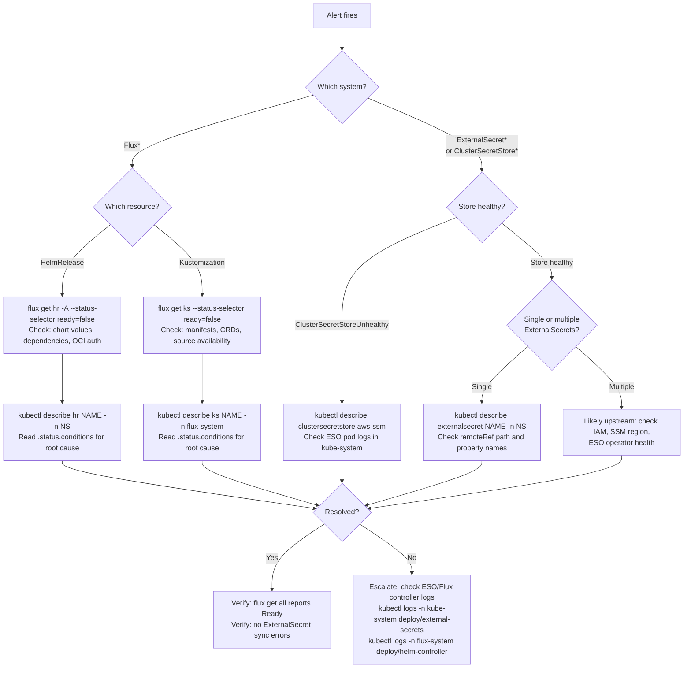

# GitOps and Platform Alerts

Runbook for Flux GitOps reconciliation alerts and External Secrets synchronization alerts. These two systems form the foundation of the platform's declarative delivery pipeline: Flux reconciles desired state from git into the cluster, and External Secrets provisions credentials from AWS SSM into Kubernetes Secrets.

When either system fails, applications cannot deploy or authenticate.

## Quick Reference

| Alert | Severity | Likely Cause | First Action |
|-------|----------|-------------|--------------|
| `FluxHelmReleaseFailing` | warning | Bad chart values, missing dependency, OCI pull failure | `flux get helmreleases -A --status-selector ready=false` |
| `FluxKustomizationFailing` | warning | Invalid manifests, missing CRDs, dependency failure | `flux get kustomizations --status-selector ready=false` |
| `ExternalSecretSyncFailure` | warning | SSM parameter missing, IAM permissions, network issue | `kubectl get externalsecret -A -o wide` |
| `ExternalSecretNotReady` | warning | Provider error, malformed remoteRef, secret store down | `kubectl describe externalsecret <name> -n <ns>` |
| `ClusterSecretStoreUnhealthy` | critical | AWS credentials expired, IAM policy changed, ESO crash | `kubectl get clustersecretstore -o wide` |

## Triage Decision Tree



## Alert Procedures

### Flux Reconciliation

Covers `FluxHelmReleaseFailing` and `FluxKustomizationFailing` alerts.

#### Symptoms

- HelmRelease or Kustomization stuck in `Ready=False` state for more than 30 minutes
- Flux dashboard shows resources in Failed or Stalled condition
- New deployments or version bumps not taking effect

#### Investigation

**Step 1: Identify failing resources**

```bash
# List all failing HelmReleases
KUBECONFIG=~/.kube/<cluster>.yaml flux get helmreleases -A --status-selector ready=false

# List all failing Kustomizations
KUBECONFIG=~/.kube/<cluster>.yaml flux get kustomizations --status-selector ready=false
```

**Step 2: Read the failure reason**

```bash
# HelmRelease details (check .status.conditions)
KUBECONFIG=~/.kube/<cluster>.yaml kubectl describe helmrelease <name> -n <namespace>

# Kustomization details
KUBECONFIG=~/.kube/<cluster>.yaml kubectl describe kustomization <name> -n flux-system
```

**Step 3: Check common root causes**

| Failure Reason | Meaning | Fix |
|----------------|---------|-----|
| `install retries exhausted` | Helm install failed repeatedly | Check chart values and pod events |
| `upgrade retries exhausted` | Helm upgrade failed | Review values diff, check breaking changes |
| `chart pull error` | Cannot fetch chart from registry | Verify OCI auth, registry URL, chart version exists |
| `dependency not ready` | A `dependsOn` resource is failing | Fix the dependency first |
| `build error` | Kustomize build failed | Check for invalid YAML, missing resources |
| `health check failed` | Deployed resources did not become healthy | Check pod logs and events in target namespace |

```bash
# Check Helm controller logs for HelmRelease issues
KUBECONFIG=~/.kube/<cluster>.yaml kubectl logs -n flux-system deploy/helm-controller --tail=50 | grep <release-name>

# Check Kustomize controller logs for Kustomization issues
KUBECONFIG=~/.kube/<cluster>.yaml kubectl logs -n flux-system deploy/kustomize-controller --tail=50 | grep <kustomization-name>

# Check events in the target namespace
KUBECONFIG=~/.kube/<cluster>.yaml kubectl get events -n <namespace> --sort-by='.lastTimestamp' --field-selector type=Warning
```

**Step 4: Check if the source is available**

```bash
# Check OCI repository source
KUBECONFIG=~/.kube/<cluster>.yaml kubectl get ocirepository -n flux-system -o wide

# Check git repository source (dev cluster only)
KUBECONFIG=~/.kube/<cluster>.yaml kubectl get gitrepository -n flux-system -o wide
```

#### Remediation

**Bad chart values:** Fix the values file in git and push. Flux will reconcile automatically.

**Missing dependency:** Check `dependsOn` chain and fix the earliest failing resource.

**Stalled resource (stopped retrying):** Suspend and resume to reset retry counter:

```bash
KUBECONFIG=~/.kube/<cluster>.yaml flux suspend helmrelease <name> -n <namespace>
KUBECONFIG=~/.kube/<cluster>.yaml flux resume helmrelease <name> -n <namespace>
```

**Force reconciliation after git fix:**

```bash
KUBECONFIG=~/.kube/<cluster>.yaml flux reconcile source oci flux-system -n flux-system
KUBECONFIG=~/.kube/<cluster>.yaml flux reconcile kustomization platform -n flux-system
```

### Secret Synchronization

Covers `ExternalSecretSyncFailure`, `ExternalSecretNotReady`, and `ClusterSecretStoreUnhealthy` alerts.

#### Symptoms

- ExternalSecrets showing `SecretSyncedError` or `Ready=False`
- ClusterSecretStore not in Ready state
- Applications failing to start due to missing or empty secrets
- `increase(externalsecret_sync_calls_error[5m]) > 0` for individual ExternalSecrets

#### Investigation

**Step 1: Check the ClusterSecretStore health (always check first)**

```bash
# Store health -- if this is unhealthy, all ExternalSecrets are affected
KUBECONFIG=~/.kube/<cluster>.yaml kubectl get clustersecretstore -o wide

# Detailed store status
KUBECONFIG=~/.kube/<cluster>.yaml kubectl describe clustersecretstore aws-ssm
```

**Step 2: If store is healthy, check individual ExternalSecrets**

```bash
# List all ExternalSecrets with their sync status
KUBECONFIG=~/.kube/<cluster>.yaml kubectl get externalsecret -A -o wide

# Describe the failing ExternalSecret
KUBECONFIG=~/.kube/<cluster>.yaml kubectl describe externalsecret <name> -n <namespace>
```

**Step 3: Check common root causes**

| Failure Reason | Meaning | Fix |
|----------------|---------|-----|
| `ParameterNotFound` | SSM parameter path does not exist | Create the parameter in AWS SSM |
| `AccessDeniedException` | IAM policy does not allow reading the parameter | Update IAM policy for the ESO role |
| `could not get property` | JSON property key does not exist in SSM value | Verify `remoteRef.property` matches JSON keys |
| `secret store not found` | ClusterSecretStore name mismatch | Verify `secretStoreRef.name` is `aws-ssm` |
| `provider error` | Generic AWS connectivity issue | Check ESO pod logs and network policies |

```bash
# Check ESO operator logs
KUBECONFIG=~/.kube/<cluster>.yaml kubectl logs -n kube-system -l app.kubernetes.io/name=external-secrets --tail=50

# Verify the SSM parameter exists (requires AWS CLI access)
aws ssm get-parameter --name "/homelab/kubernetes/<cluster>/<secret-name>" --with-decryption
```

**Step 4: Check ESO pod health**

```bash
# ESO pods running?
KUBECONFIG=~/.kube/<cluster>.yaml kubectl get pods -n kube-system -l app.kubernetes.io/name=external-secrets

# Recent restarts or OOM?
KUBECONFIG=~/.kube/<cluster>.yaml kubectl describe pod -n kube-system -l app.kubernetes.io/name=external-secrets
```

#### Remediation

**Missing SSM parameter:** Create it in AWS:

```bash
aws ssm put-parameter \
  --name "/homelab/kubernetes/<cluster>/<secret-name>" \
  --type SecureString \
  --value '<value-or-json>'
```

**Expired AWS credentials:** The ESO access key is stored as a Kubernetes Secret in `kube-system`. If it expires, update via the ExternalSecret that provisions it, or recreate the IAM access key.

**Force ExternalSecret re-sync:**

```bash
# Annotate to trigger immediate refresh
KUBECONFIG=~/.kube/<cluster>.yaml kubectl annotate externalsecret <name> -n <namespace> \
  force-sync=$(date +%s) --overwrite
```

**ESO operator crash:** Restart the deployment:

```bash
KUBECONFIG=~/.kube/<cluster>.yaml kubectl rollout restart deployment -n kube-system external-secrets
```

## Verification

After remediation, confirm the alerts will resolve:

```bash
# Flux: all resources should show Ready=True
KUBECONFIG=~/.kube/<cluster>.yaml flux get helmreleases -A
KUBECONFIG=~/.kube/<cluster>.yaml flux get kustomizations

# External Secrets: all should show Ready status
KUBECONFIG=~/.kube/<cluster>.yaml kubectl get externalsecret -A -o wide

# ClusterSecretStore: should show Ready
KUBECONFIG=~/.kube/<cluster>.yaml kubectl get clustersecretstore -o wide

# Prometheus: verify alert is no longer firing
KUBECONFIG=~/.kube/<cluster>.yaml kubectl exec -n monitoring prometheus-kube-prometheus-stack-0 -c prometheus -- \
  wget -qO- 'http://localhost:9090/api/v1/alerts' | \
  jq '.data.alerts[] | select(.labels.alertname | test("Flux|ExternalSecret|ClusterSecretStore"))'
```

## Related

- [Promotion Pipeline](https://github.com/ionfury/homelab/blob/main/.github/CLAUDE.md) -- OCI artifact build and promotion workflow
- [Secrets Management](https://github.com/ionfury/homelab/blob/main/.claude/skills/secrets/SKILL.md) -- ExternalSecret, secret-generator, and replicator patterns
- [Flux GitOps Skill](https://github.com/ionfury/homelab/blob/main/.claude/skills/flux-gitops/SKILL.md) -- HelmRelease and ResourceSet patterns
- [Platform Config](https://github.com/ionfury/homelab/blob/main/kubernetes/platform/config/CLAUDE.md) -- Config subsystem organization
