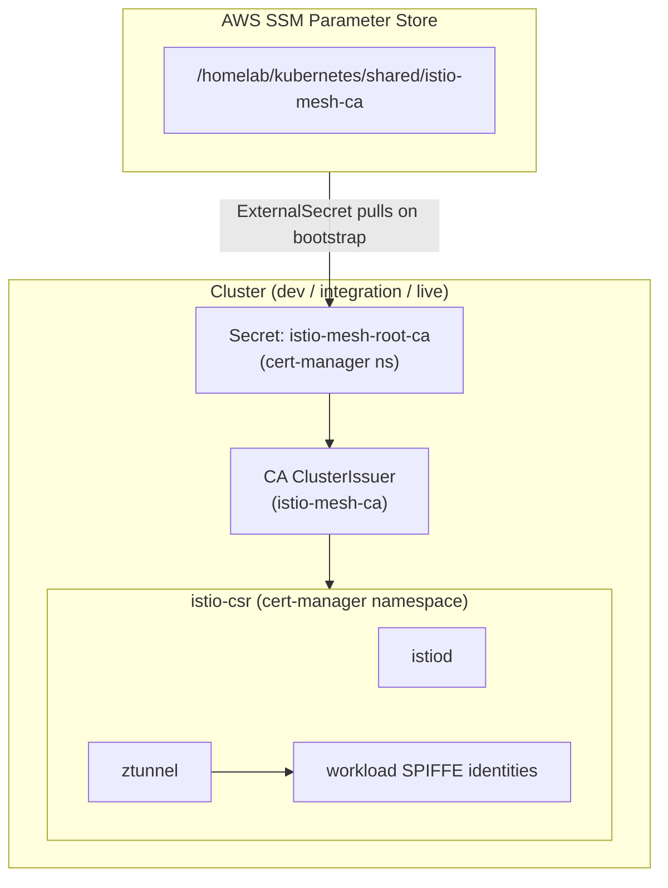

# Istio Mesh PKI (istio-csr)

Istio mesh mTLS certificates are issued by cert-manager via [istio-csr](https://github.com/cert-manager/istio-csr), providing unified PKI management across both ingress TLS and service mesh identity.

## Architecture



## Key Configuration

| Setting | Value | Rationale |
|---------|-------|-----------|
| CA type | SSM-backed, persistent | Survives cluster rebuilds, shared across all clusters |
| CA scope | Shared (all clusters) | Enables cross-cluster mTLS trust |
| Certificate validity | 24 hours | Balance between security and renewal overhead |
| Renewal window | 12 hours | Renew at 50% lifetime |
| CA validity | 10 years | Long-lived root, short-lived workload certs |

## How It Works

1. **ExternalSecret** pulls root CA from SSM on cluster bootstrap
2. **CA ClusterIssuer** references the synced secret
3. **istio-csr** replaces Istio's built-in CA (`ENABLE_CA_SERVER: "false"` in istiod)
4. **istiod and ztunnel** request certificates from `cert-manager-istio-csr.cert-manager.svc:443`
5. **ztunnel** (Ambient mode) authenticates with its own identity but requests certs for workloads via `caTrustedNodeAccounts`

## Files

| Path | Purpose |
|------|---------|
| `config/issuers/istio-mesh-ca/` | ExternalSecret and CA ClusterIssuer |
| `charts/istio-csr.yaml` | istio-csr Helm values |
| `charts/istiod.yaml` | Disabled built-in CA, points to istio-csr |
| `charts/istio-ztunnel.yaml` | CA address for Ambient mode |

## Bootstrap

The mesh CA is generated by the `global` infrastructure stack and stored in SSM. Run `task tg:apply-global` before deploying any cluster. The CA backup is written to `~/.secrets/homelab/istio-mesh-ca.json` for disaster recovery.

## Verifying Certificate Issuance

```bash
# Check ExternalSecret synced
kubectl -n cert-manager get externalsecret istio-mesh-root-ca

# Check CA ClusterIssuer is ready
kubectl get clusterissuer istio-mesh-ca

# Check istio-csr is running
kubectl -n cert-manager get pods -l app=cert-manager-istio-csr

# Check CertificateRequests are being fulfilled
kubectl get certificaterequests -n istio-system
```
